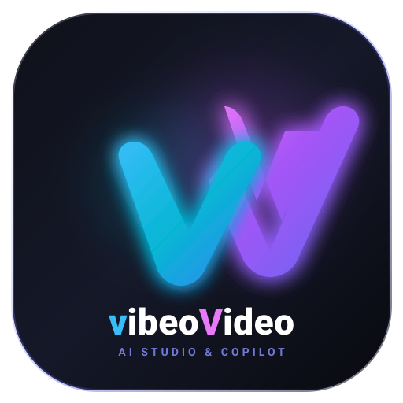

<p align="center">
  
</p>

# 🎬 vibeoVideo - Next-Gen OpenAI AI Studio for Shotcut

**vibeoVideo** is a native AI plugin and companion suite for **Shotcut Video Editor**, bringing the power of **OpenAI GPT-5.6 Luna, DALL-E 3, and Whisper** directly into your video editing workflow.

---

## ✨ Features at a Glance

| Feature | Powered By | Description |
| :--- | :--- | :--- |
| **Agentic Command Center** | Autonomous Agent & Win32 Dock | Pinned "Open vibeoVideo" option at the top of the screen right next to "Help", opening an autonomous agent command center window. |
| **Viral Titles & Hooks** | OpenAI GPT-5.6 Luna | Generate high-converting YouTube titles and 3-second opening video hooks directly in your video timeline. |
| **Lower Thirds & Captions** | OpenAI GPT-5.6 Luna | Create clean 2-line name/title lower thirds, scene summaries, and call-to-action (CTA) overlays. |
| **Instant Translation** | OpenAI GPT-5.6 Luna | Translate video scripts, lower thirds, and captions into Spanish, French, German, Japanese, and more. |
| **B-Roll & Backgrounds** | OpenAI DALL-E 3 | Generate 16:9 cinematic widescreen, 9:16 vertical Shorts, or square concept images directly in the editor. |
| **Interactive Video Gizmo** | Shotcut `TextFilterVui` | On-screen interactive drag, drop, and resize handles right in the Shotcut video player window. |
| **Conversation Memory** | Sliding Token Window | Full multi-turn conversational memory with smart token pruning to preserve context across long sessions. |
| **⚠️ Dangerous High-Token Mode** | Custom Token Thresholds | Unlock extended context windows (up to 128k tokens) and expanded outputs (up to 8,192 tokens) beyond defaults. |
| **Video Modification Engine** | In-Filter & FFmpeg Tools | Complete live control over on-screen typography, geometry, styles, colors, presets, and FFmpeg video transformations. |
| **Auto-Director & Roughcut** | Intelligent Silence Stripper | 1-Click magic roughcut: removes dead air/silences and generates a ready-to-open Shotcut `.mlt` timeline. |
| **Viral Shorts Repurposer** | AI Highlight Hunter | Analyzes dialogue, extracts the top 30-45s retention hook, converts to 9:16 vertical, and burns subtitles. |
| **Cinematic SFX Synthesizer** | Procedural Audio DSP | Generate broadcast-quality sound effects (Whooshes, Sub Booms, Risers, Pops, Camera Shutters) with live audition. |
| **Shotcut Timeline Remote** | Win32 Hotkey Engine | Direct timeline transport bar (Play/Pause, Split `S`, Ripple Delete `X`, Step Frames, Undo) without leaving the agent. |
| **Whisper Auto-Subtitles** | OpenAI Whisper-1 | Auto-transcribe audio/video speech into standard `.srt` subtitle files with millisecond timestamps. |
| **AI Voiceovers (TTS)** | OpenAI TTS (`tts-1`) | Generate crystal-clear AI narration tracks (`alloy`, `echo`, `fable`, `onyx`, `nova`, `shimmer`) ready for your timeline. |
| **Secure Key Storage** | SQLite / LocalStorage | Your OpenAI API key is stored locally on your machine with masked inputs and connection testing. |

---

## 🚀 Quick Installation

### Option 1: Automatic 1-Click Install (Recommended)

Run the included PowerShell installer from the project directory:

```powershell
powershell -ExecutionPolicy Bypass -File .\install.ps1
```

This automatically copies the plugin files into Shotcut's user extension directory:
`%LOCALAPPDATA%\Meltytech\Shotcut\extensions\filters\vibeo_video`

*(No administrator privileges required, and your plugin persists across Shotcut software updates!)*

### Option 2: Manual Installation

Copy the `filters/vibeo_video` folder to:
`%LOCALAPPDATA%\Meltytech\Shotcut\extensions\filters\vibeo_video`

*(If the `extensions\filters` folder does not exist, simply create it.)*

---

## 🎯 How to Use vibeoVideo in Shotcut

### Step 1: Open Shotcut & Add the Filter
1. Launch **Shotcut**.
2. Add any video clip, image, or transparent color clip (`Open Other > Color`) to your timeline.
3. Select the clip and click the **Filters** panel (`+` icon).
4. Search for **vibeoVideo** (located under the **Video** filter category).
5. Click to add it to your clip.

### Step 2: Set Your OpenAI API Key
1. In the vibeoVideo panel, switch to the **⚙️ Settings** tab.
2. Paste your OpenAI API Key (`sk-...`).
3. Click **⚡ Test Connection** to verify your key.
4. Click **💾 Save Key** to permanently store it for future editing sessions.

### Step 3: Generate AI Video Overlays
1. Switch to the **✍️ AI Text** tab.
2. Select your desired **Mode**:
   - 🔥 *Viral Video Title*
   - 🪝 *3-Second Opening Hook*
   - 🏷️ *Lower Third (Name & Role)*
   - 📝 *Scene Caption & Summary*
   - 📢 *Call to Action (CTA)*
   - 🌐 *Language Translator*
   - 💬 *Custom AI Prompt*
3. Enter your topic or scene context (e.g. *"Tech reviewer explaining battery lifespan"*).
4. Click **✨ Generate with vibeoVideo**.
5. The generated text is immediately rendered live onto your video preview!
6. Use the **📐 Style & Layout** tab to customize fonts, colors, background boxes, outlines, or use Shotcut's on-screen box to drag and position your graphic.

### Step 4: Generate DALL-E 3 B-Roll Images
1. Switch to the **🎨 DALL-E 3** tab.
2. Enter an image description (e.g. *"Cinematic wide drone shot of futuristic cyberpunk city with neon lights"*).
3. Choose a style preset and aspect ratio (**16:9 Landscape** for standard video, or **9:16** for TikTok/Shorts).
4. Click **🎨 Generate B-Roll Image**.
5. Preview the result and click **Open in Web Browser / Download** to save it and drop it directly onto your Shotcut timeline!

---

## ⚡ Agentic AI Command Center & Top-of-Screen Dock

vibeoVideo includes a separate **Agentic AI Command Center** window with an automated **Top-of-Screen Dock** that sits right next to the **Help** menu on Shotcut's menu bar:

### How It Works
1. Launch the command center:
   - Double-click **`run_vibeo_command_center.bat`** (or click **`🚀 AI Center`** in the vibeoVideo filter inside Shotcut).
2. **Top-Bar Dock**:
   - When Shotcut is open, a sleek pill button **`[✨ Open vibeoVideo]`** automatically docks at the top of your screen, right next to the **Help** menu on Shotcut's menu bar!
   - Clicking it brings the **Agentic Command Center** to the foreground.
3. **Agentic Capabilities & Video Tools**:
   - **🧠 Multi-Turn Conversation Memory**: Retains the entire conversation across questions and commands with an intelligent sliding context window that automatically manages token consumption.
   - **⚠️ Dangerous High-Token Mode**: Optional setting to unlock massive input contexts (up to 128k tokens) and output capacities (up to 8,192 tokens) for deep video analysis.
   - **🎬 Autonomous Video Transformations**:
     - `trim_video`: Cut and trim video clips to specified timestamps.
     - `convert_vertical`: Crop and convert 16:9 videos to 9:16 vertical format for TikTok, Instagram Reels, and YouTube Shorts.
     - `extract_audio`: Extract pristine MP3 audio from any video.
     - `burn_subtitles`: Hardcode and burn styled subtitles directly into video footage.
     - `change_speed`: Speed up (timelapse) or slow down video footage.
     - `extract_thumbnail`: Capture high-resolution video frame screenshots.
     - `compress_video`: Smart compression for web, Discord, or email delivery.
     - `modify_mlt`: Inspect and inject filter definitions directly into Shotcut `.mlt` XML project files.
   - **🎙️ Subtitle Studio**: Extract audio and transcribe with OpenAI Whisper into synced `.srt` files.
   - **🗣️ Voiceover Studio**: Turn scripts into studio voiceover audio tracks (`alloy`, `echo`, `fable`, `onyx`, `nova`, `shimmer`).
   - **🎨 DALL-E 3 B-Roll Studio**: Generate 16:9 widescreen or 9:16 vertical AI imagery and download directly into project folders.
   - **📁 Shotcut Project Inspector**: Inspect `.mlt` XML files, list track counts, media sources, and duration.

---

## 🎙️ vibeoVideo AI Companion (Whisper Subtitles & TTS Voiceovers)

For batch audio processing, subtitle generation, and text-to-speech, vibeoVideo includes a companion desktop app.

### Running the Classic Companion Tool

Double-click `companion\run_companion.bat` or run via terminal:

```bash
python companion\vibeo_companion.py
```

### 1. Whisper Audio Transcriber (`.srt` subtitles)
1. Select any video or audio file (`.mp4`, `.mov`, `.mkv`, `.mp3`, `.wav`, `.m4a`).
2. The tool uses Shotcut's bundled `ffmpeg.exe` to isolate the dialogue track.
3. Transcribes speech using OpenAI Whisper (`whisper-1`) with timestamp precision.
4. Produces a standard `.srt` subtitle file ready to import into Shotcut's Subtitles track or open as a text source.

### 2. Text-to-Speech (TTS Voiceover Studio)
1. Paste your narration script.
2. Choose your voice: `alloy`, `echo`, `fable`, `onyx`, `nova`, or `shimmer`.
3. Select quality (`tts-1` or `tts-1-hd`).
4. Click **🎙️ Generate Voiceover Audio** to export a `.mp3` clip ready to drop on an audio track in Shotcut.

### CLI Mode (Scripting & Automation)

You can also run the companion tool headlessly from the command line:

```bash
# Auto-generate .srt subtitles from a video
python companion\vibeo_companion.py --transcribe video.mp4 --key sk-proj-...

# Generate a voiceover narration
python companion\vibeo_companion.py --tts "Welcome back to the channel! Today we explore quantum computing." --voice nova --key sk-proj-...
```

---

## 🏗️ Technical Architecture

```
shotcut-vibeovideo/
├── filters/
│   └── vibeo_video/
│       ├── meta.qml            # Filter manifest for Shotcut plugin loader
│       ├── ui.qml              # Qt 6 QML Filter UI (Tabs, Controls, Live Preview)
│       ├── vui.qml             # Video viewport interactive manipulation gizmo
│       ├── OpenAiClient.js     # Asynchronous OpenAI REST engine (XMLHttpRequest)
│       ├── vibeoStorage.js     # Persistent SQLite/LocalStorage manager
│       ├── icon.webp           # Shotcut filter list icon (128x128 WebP vV logo)
│       ├── icon.png            # High-res vV icon asset
│       └── logo.svg            # Scalable vV vector logo
├── companion/
│   ├── vibeo_agent_center.py   # Agentic Command Center desktop app
│   ├── vibeo_companion.py      # Desktop GUI & CLI for Whisper & TTS
│   ├── vibeo_icon.ico          # Windows multi-size application icon
│   ├── vibeo_logo_icon.png     # vV logo badge asset
│   └── run_companion.bat       # Quick-launch launcher
├── install.ps1                 # Automated PowerShell installer
├── uninstall.ps1               # Clean uninstaller script
└── README.md                   # Full documentation
```

### Compatibility
- **Shotcut**: Shotcut 22.09, 23.x, 24.x, and newer (Qt 6 Quick architecture)
- **OS**: Windows 10/11, macOS, and Linux
- **OpenAI Models**: `gpt-5.6-luna` (default), `gpt-4o`, `gpt-4o-mini`, `gpt-3.5-turbo`, `dall-e-3`, `whisper-1`, `tts-1`, `tts-1-hd`
